# RetailFlow AI 🚀

<div align="center">

# 🛒 RetailFlow AI

### B2B Smart Supply, Billing & Demand Intelligence System

*A generative‑AI powered platform that automates inventory, billing, and supplier negotiations for retail stores.*

<br>

<p align="center">


</p>

</div>

---

## 📑 Table of Contents

- [Overview](#-overview)
- [Problem Statement](#-problem-statement)
- [Key Features](#-key-features)
- [System Architecture](#-system-architecture)
- [Screenshots](#-screenshots)
- [API Endpoints](#-api-endpoints)
- [Tech Stack](#-tech-stack)
- [Installation](#-installation)
- [Test Credentials](#-test-credentials)
- [Project Structure](#-project-structure)
- [Future Improvements](#-future-improvements)
- [Contributing](#-contributing)
- [Acknowledgements](#-acknowledgements)
- [Author](#-author)
- [Support](#-support)

---

## 📖 Overview

RetailFlow AI is an **event‑driven Generative‑AI system** that streamlines the entire supply chain for retail stores. It automatically:

1. **Processes sales** and updates inventory in real‑time.
2. **Detects low‑stock thresholds** and triggers a smart restocking workflow.
3. **Matches suppliers** using an AI‑driven negotiation agent.
4. **Provides human‑in‑the‑loop approvals** for high‑value transfers.
5. **Delivers SQL‑style analytics** and profit dashboards via a Streamlit UI.

Built with **FastAPI**, **LangChain**, **LangGraph**, **FAISS**, **SQLite**, and **Streamlit**, with GPU‑accelerated LLM calls to **NVIDIA**.

---

## 🎯 Problem Statement

Retail stores often suffer from:

- Manual inventory updates → stock‑outs.
- Time‑consuming supplier negotiations.
- Lack of real‑time analytics on profit margins.

Existing ERP solutions are heavyweight and lack AI‑driven decision‑making. **RetailFlow AI** solves these pain points by combining generative AI with a lightweight, containerized stack.

---

## ✨ Key Features

### ⚙️ Smart Billing & Inventory
- Real‑time stock decrement on each sale.
- Automatic low‑stock detection.

### 🤖 AI‑Driven Supplier Matching
- Multi‑agent `seller_agent` evaluates supplier offers.
- Utilises LangChain for LLM reasoning.

### 👤 Human‑in‑the‑Loop Approval
- Workflow pauses for manual approval before final transfer.
- Supports role‑based JWT authentication.

### 📈 Analytics & Profit Dashboard
- Streamlit UI visualises profit trends (`assets/Ml_profit.png`).
- SQL endpoint for ad‑hoc queries.

### 📦 Modular Architecture
- FastAPI for core services.
- LangGraph state machine orchestrates the workflow.
- FAISS + SQLite for vector and relational storage.

---

## 🏗️ System Architecture

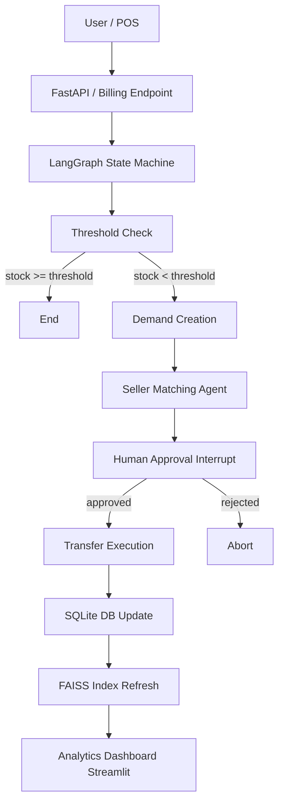

---

## 📸 Screenshots

### Main Dashboard
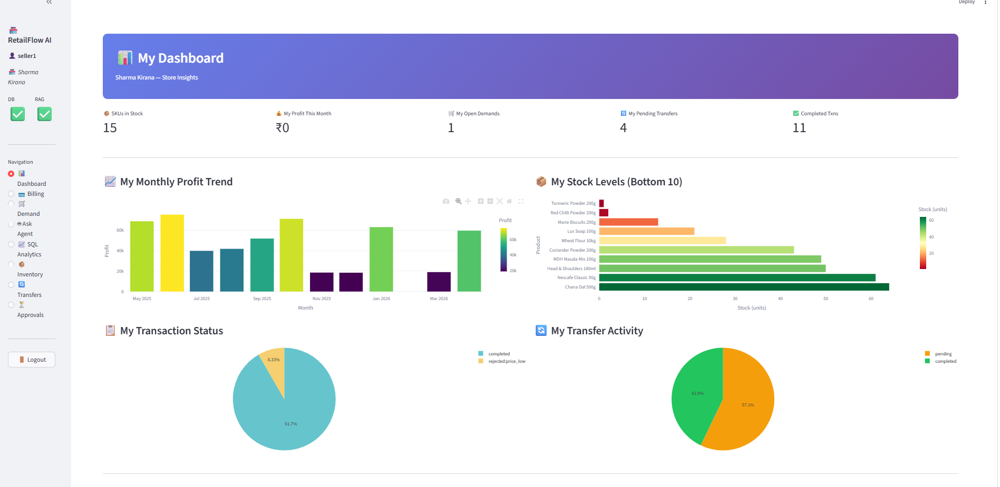

### 🛒 1. Smart Billing & Inventory Tracking
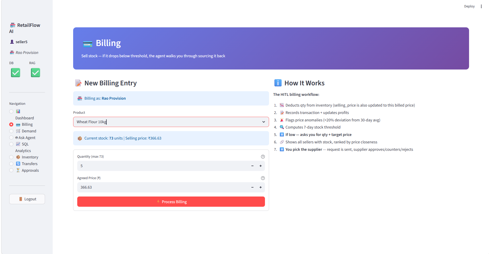

### ⚠️ 2. Automated Low‑Stock Triggers
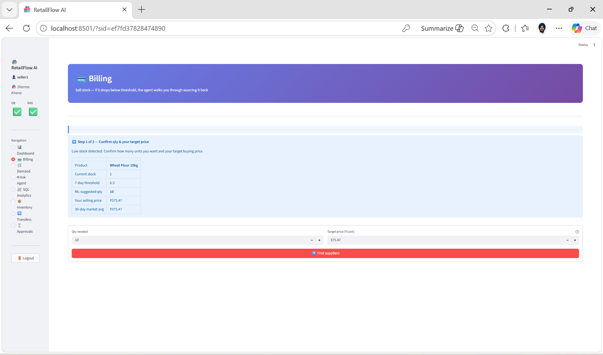

### 🤝 3. Supplier Matching & Agent Negotiation
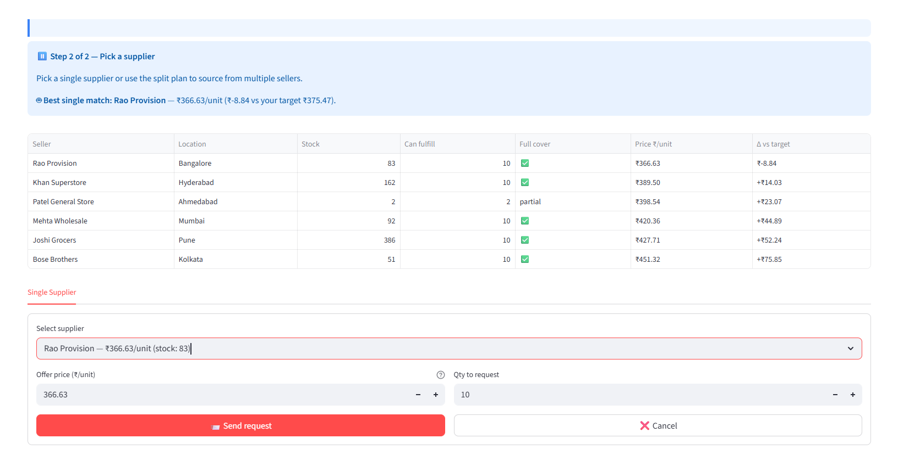
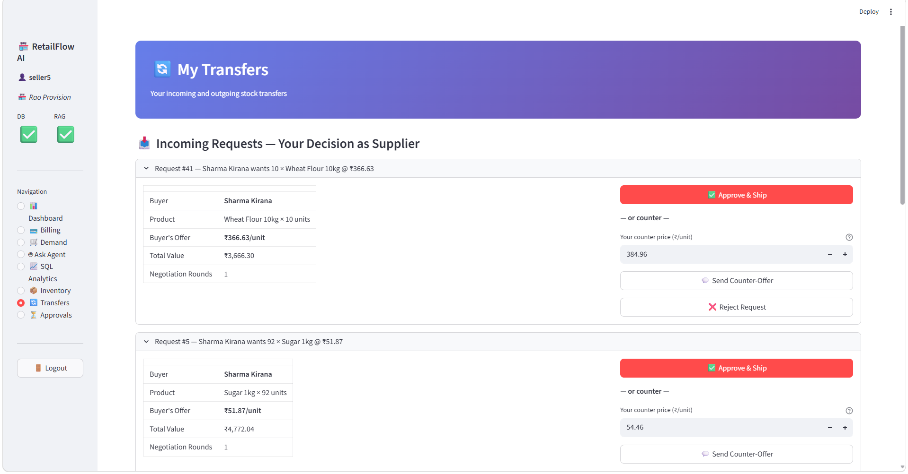

### ⏳ 4. Human‑in‑the‑Loop Approval
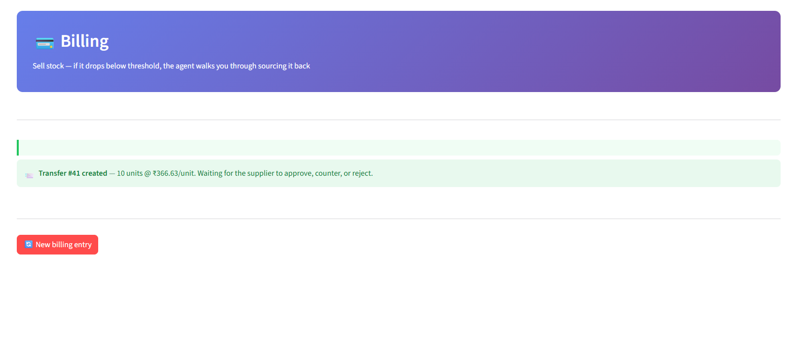
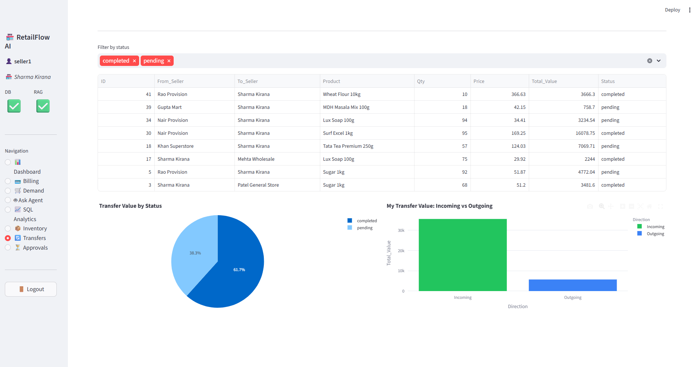

### 📊 5. Analytics & Demand Intelligence
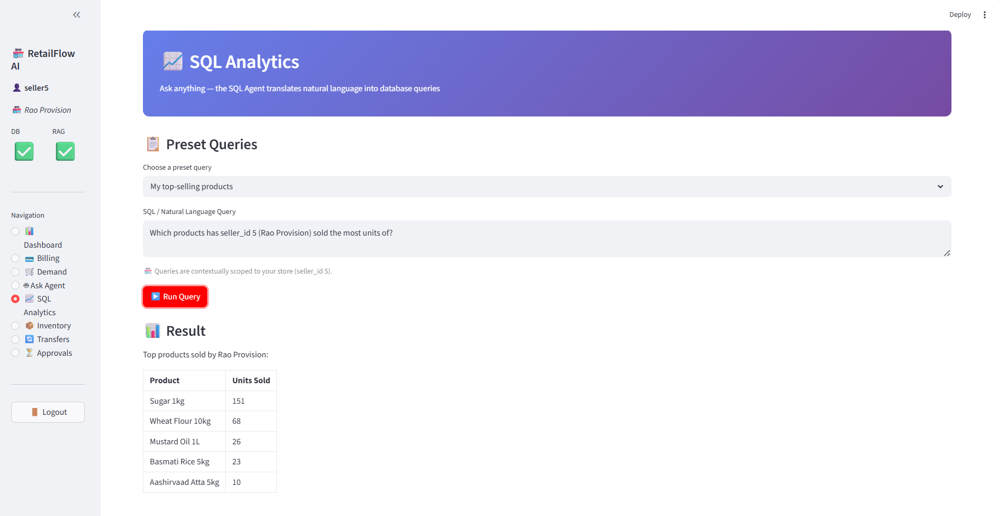
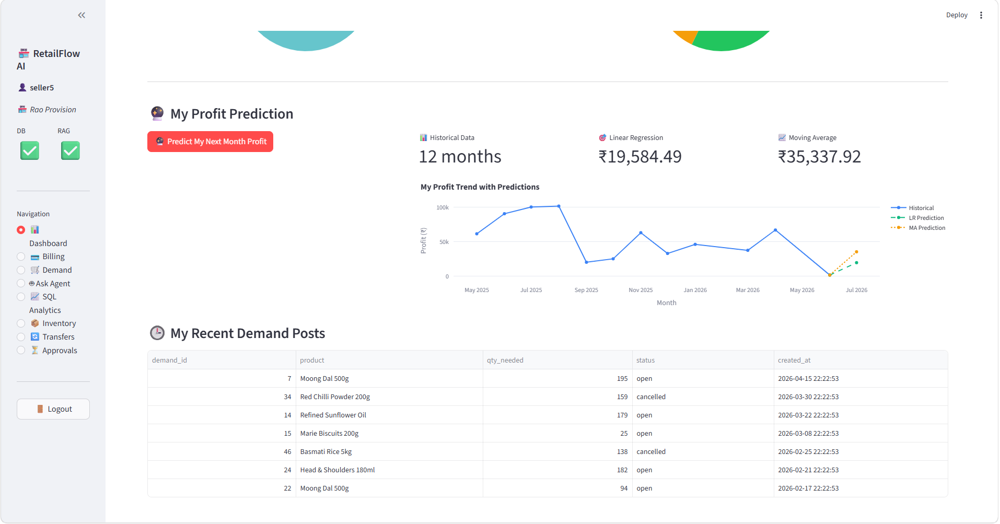

---

## 🌐 API Endpoints

| Method | Endpoint | Description |
|--------|----------|-------------|
| POST | `/auth/token` | Obtain JWT token |
| POST | `/billing` | Register a sale – triggers workflow |
| POST | `/billing/approve/{thread_id}` | Approve/reject a transfer |
| POST | `/demand` | Manual demand creation |
| POST | `/demand/approve/{thread_id}` | Approve/reject demand |
| POST | `/ask` | Natural‑language queries (RAG/SQL/Demand) |
| GET  | `/sql` | Run ad‑hoc SQL analytics |
| GET  | `/health` | Health check |

---

## 🚀 Tech Stack

| Category | Technologies |
|----------|--------------|
| Language | Python 3.11 |
| Backend | FastAPI |
| AI / LLM | NVIDIA LLM (via LangChain) |
| Framework | LangChain, LangGraph |
| Vector DB | FAISS |
| Relational DB | SQLite |
| Containerization | Docker, Docker‑Compose |
| UI | Streamlit |
| CI/CD | GitHub Actions |

---

## ⚙️ Installation

```bash
# 1. Clone the repo
git clone https://github.com/asr09122/retailflow-ai.git
cd retailflow-ai

# 2. Create a virtual environment (optional)
python3 -m venv .venv
source .venv/bin/activate

# 3. Install dependencies (uses uv for speed)
uv sync

# 4. Set up environment variables
cp .env.example .env
# Edit .env – at minimum you need an NVIDIA_API_KEY and a JWT SECRET_KEY

# 5. Initialise the database (choose one)
# Production – Alembic migrations
uv run alembic upgrade head
uv run python scripts/seed_db.py

# Development – direct init
uv run python scripts/init_db.py
uv run python scripts/seed_db.py

# 6. Build the FAISS RAG index (downloads ~90 MB model on first run)
uv run python scripts/init_rag.py

# 7. Start the services
# Backend API (in one terminal)
uv run uvicorn app.main:app --reload

# Streamlit Dashboard (in another terminal)
uv run streamlit run streamlit_app.py
```

**API docs:** http://localhost:8000/docs  
**Dashboard:** http://localhost:8501  

---

## 🔐 Test Credentials

| Username | Password | Seller ID |
|----------|----------|-----------|
| admin | retailflow123 | 1 |
| seller1 | password1 | 1 |

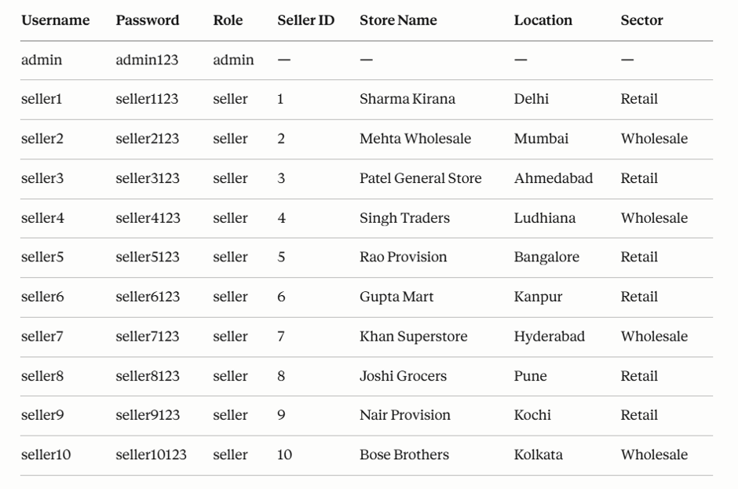

---

## 📂 Project Structure

```text
retailflow-ai/
├─ .env.example               # Example env file
├─ app/                       # FastAPI application
│   ├─ main.py                # Entry point
│   ├─ routes/                # API routers (auth, billing, demand, ask, sql)
│   ├─ agents/                # LangGraph agents (graph, rag, demand, seller, sql)
│   ├─ tools/                 # DB & vector tools
│   ├─ rag/                   # FAISS ingest & retriever
│   └─ core/                  # Config & security helpers
├─ assets/                    # Images used in this README
├─ scripts/                   # DB init, seeding, RAG indexing
├─ streamlit_app.py           # Streamlit UI
├─ docker-compose.yml         # Docker compose for multi‑container dev
├─ Dockerfile                 # Container image for the API
├─ requirements.txt           # Pin‑pinned deps (generated by uv)
├─ tests/                     # Unit / integration tests
└─ README.md                  # This file
```

---

## 📈 Future Improvements

- 📊 Interactive analytics dashboard with drill‑down capabilities.
- 🤝 Multi‑store and multi‑tenant support.
- 🛠️ Plug‑in architecture for custom supplier scoring models.
- ☁️ Deploy to cloud (AWS ECS, GCP Cloud Run, Azure Container Apps).
- 📱 Mobile‑friendly progressive web app.
- 🔐 End‑to‑end encryption for data at rest and in transit.

---

## 🤝 Contributing

Contributions are welcome! Please follow these steps:

1. Fork the repository.
2. Create a feature branch (`git checkout -b feature/awesome-feature`).
3. Commit your changes with a clear message.
4. Push to your fork and open a Pull Request.
5. Ensure CI passes (tests, linting).

---

## 🙏 Acknowledgements

Thanks to the open‑source community for the amazing tools that make this project possible:

- Meta LLaMA‑3 for the underlying LLM.
- LangChain & LangGraph for orchestration.
- FAISS for efficient vector similarity.
- FastAPI for high‑performance APIs.
- Streamlit for rapid UI prototyping.
- Docker for reproducible environments.

---

## 👨‍💻 Author

### Abhayjot Singh

Generative AI Engineer – building production‑ready AI applications with LLMs, RAG, multi‑agent systems, FastAPI and LangChain.

---

## ⭐ Support

If you found this repository useful, please give it a ⭐ on GitHub. Your support motivates further development and helps other developers discover the project.

---

## ❤️ Thank you for visiting!

Made with ❤️ using Python, FastAPI, LangChain, FAISS, Docker, and Streamlit.
